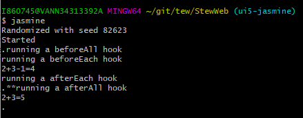

## What is Jasmine

* A unit test framework
* BDD (behavior-driven) 
* [Document](https://jasmine.github.io/pages/docs_home.html)

## Setup and installation

**A short introduction for Jasmine setup and how Jasmine looks like in the big picture.**

* Install Node.js

* Please note, use `$npm install` to automatically install all the dependencies and plugins. You can ignore all the `$npm install xxx` instructions unless you are interested in all the details and steps. 

* Install Jasmine `$npm install -g jasmine`

* Run Jasmin by `$ jasmine` or `npm test`

* Initialize Jasmine `$jasmine init`

  * It will create a folder `spec`, which saves all the Jasmine tests
    * Inside `spec`, it has `support` folder

* Create a test file by `$touch test.spec.js`

  * Jasmine will take all particular files that suffix as `.spec.js` . It is configured in the `spec/support/jasmine.json`

    ```javascript
    descript('hello world', function(){
    	it('hello test', function() {
    
    	});
    });
    ```

* Go to root folder `/StewWeb` level, `$jasmine` to run test

  ```shell
  Randomized with seed 55149
  Started
  .
  
  
  1 spec, 0 failures
  Finished in 0.005 seconds
  Randomized with seed 55149 (jasmine --random=true --seed=55149)
  ```

* 

## Keyword Explanation

```javascript
describe('calculate addition', function(){
	it('should be able to add two numbers together', function() {
		console.log("2+3=" + (2+3));
		expect(calculate.add(2,3)).tobe(5);
	});

	it('should be able to add three numbers together', function() {
		console.log("1+2+3=" + (1+2+3));
	});

	describe('calculate addition with minus numbers', function(){
		it('should be able to add two numbers together then minus', function() {
			console.log("2+3-1=" + (2+3-1));
		});
	});	
});
```

* `describe `block

  * Designed to contain multiple tests. Group tests which is closely related together
  * Two parameters. The first one is the name of describe block. The second one is the callback function

* `it` block

  * It is where you write tests
  * Two parameters. The first one is the name of it block. The second one is the callback function

* `expect` statement

  * Allow us to check or validate or confirm the value

  * There are a lot of way to writing `expect` statement

    ```javascript
    // for numbers
    expect(something).toBe(something);
    expect(something).not.toBe(something);
    
    expect(something).toEqual(something);
    expect(something).not.toEqual(something);
    
    expect(something).toBeLessThen(something);
    expect(something).toBeGreaterThen(something);
    expect(something).not.toBeLessThen(something);
    expect(something).not.toBeGreaterThen(something);
    
    // for class
    expect(something).toBeDefined();
    expect(something).not.toBeUndefined();
    expect(something).not.toBeNull();
    
    // for string
    expect(something).toMatch(something);
    expect(something).not.toMatch(something);
    
    expect(something).toContain(something);
    expect(something).not.toContain(something);
    
    // for more instance, check "https://jasmine.github.io/tutorials/your_first_suite"
    ```

  * `fit` block

    * Same as `it` block, but `fit` means `f(ocus) it`. Then Jasmine will only execute this particular block.
    * Please make sure `f` is removed from `fit` later

  * `xit` block

    * Ignore this test so far right now. Then Jasmine will NOT execute this particular block
    * Please make sure `x` is removed from `xit` later

* Hook

  * Run a certain code before or after running tests
  * Usually used for setting up and clean
  * Types
    * `beforeAll()`
      * Run hook before all `it` block, and just one time
    * `beforeEach()`
      * Run hook before each `it` block
    * `afterAll()`
      - Run hook after all `it` block and just one time
    * `afterEach()`
      - Run hook after each `it` block

## Run Jasmine

**All things that related to TEW begins now.**

* Two ways to run Jasmine to execute your tests

  1. Run in the browser (file:///C:/Users/i860745/git/tew/StewWeb/SpecRunner.html)

     

  2. Run in the command line 
     * In the `/StewWeb ` level, run `$npm test` or `$jasmine` 

       

## Jasmine with TEW

In this section, you will be ready to run Jasmine with TEW for unit tests. Also, you will get to know detailed configuration in case you would like to edit.

###Dependency and Plugins

* Install dependencies and `browserify` 
  * Dependency
    * openui5/sap.ui.core: `npm install @openui5/sap.ui.core`
  * [Browserify](http://browserify.org/)
    * `npm install -g browserify`
    * Why we need to use `browserify`
      * `require` is the technology in server-side (i.e. Node.js)
      * browser does not support `require`, therefore we need `browserify` to auto bundle necessary files

###Jasmine Components

* `SpecRunner.html` 

  ```javascript
  <!-- This is Jasmine Components to run tests via browswer -->
  <link rel="shortcut icon" type="image/png" href="../../../node_modules/jasmine-core/images/jasmine_favicon.png">
  <link rel="stylesheet" href="../../../node_modules/jasmine-core/lib/jasmine-core/jasmine.css">
  
  <script src="../../../node_modules/jasmine-core/lib/jasmine-core/jasmine.js"></script>
  <script src="../../../node_modules/jasmine-core/lib/jasmine-core/jasmine-html.js"></script>
  <script src="../../../node_modules/jasmine-core/lib/jasmine-core/boot.js"></script>
  ```

  * Please note, if Jasmine changed any path of these components, you need adjust it as well. 

    ------------------------------------------------------------------------------------------------------------------------------------------------

  ```javascript
  <!-- TEW requires sapui5 components -->
  <script 
      src="https://sapui5.hana.ondemand.com/1.44.11/resources/sap-ui-core.js"
      id="sap-ui-bootstrap" 
      data-sap-ui-libs="sap.m,sap.ui.commons,sap.ui.unified,sap.ui.table,sap.ui.ux3,sap.ui.layout" 
      data-sap-ui-theme="sap_belize"
      data-sap-ui-xx-bindingSyntax="complex" >
  </script>
  ```

  * TEW requires SAP UI5 components while it is running. Remove it will cause undefined error

    ------------------------------------------------------------------------------------------------------------------------------------------------

  ```javascript
  <!-- include spec files here... -->
  <script src="bundle.js"></script>
  ```

  * Basically, all bundled files will be imported from here. Jasmine will run test files from `bundle.js`, therefore, you need to "bundle" your test files manually before Jasmine runs.

## Reference

* Jasmine doc
* [Browserify doc](http://browserify.org/)
* Dependency: [sap.ui.core](https://www.npmjs.com/package/@openui5/sap.ui.core)
* How to setup and bundle files by `browserify`
  * [Getting Started with Browserify](https://www.youtube.com/watch?v=CTAa8IcQh1U)
* [Jasmine SpecRunner.html introduction](https://github.com/jasmine/jasmine/wiki/A-simple-project)
* 